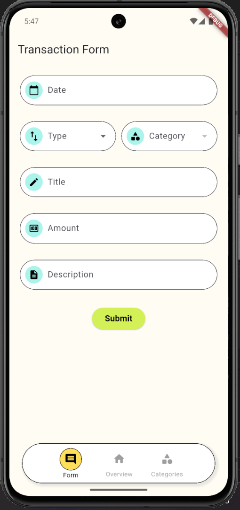
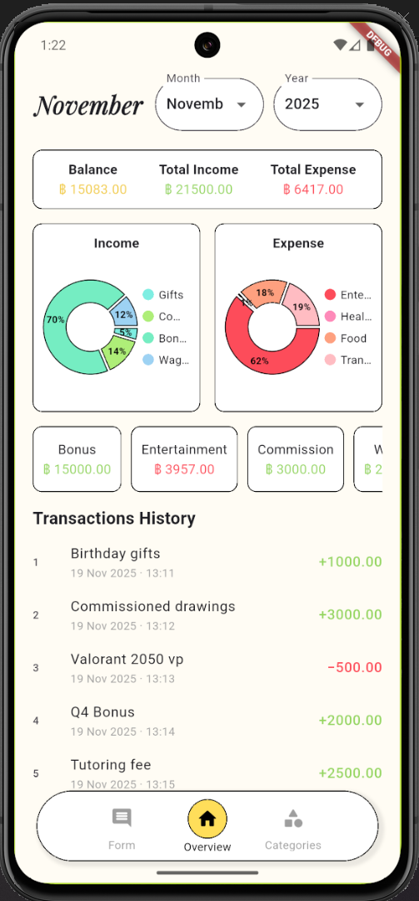
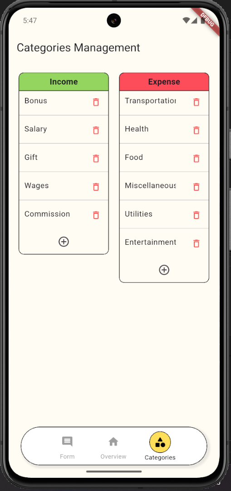

# Income-Expense Tracker Application

This is a term project for the Mobile Application Development class. It's a simple financial tracking application designed to record income and expenses and display a monthly summary, allow users to manage their finances more conveniently.

### App Preview
| Transaction Form | Monthly Overview  | Categories Management |
| :---: | :---: | :---: |
|  |  |  |

User Manual Here > https://drive.google.com/file/d/1TsL4x4Z-6MuqYDBm_tRsHHharQSm7VW-/view?usp=sharing

### Features
* Easily record new income and expense transactions
* View a detailed history of all transactions for any selected month
* Get a clear summary of total income, total expense, and current balance for the chosen month
* Visualize the proportion of spending across categories with pie chart
* View a summary list of total amounts for each category
* View, create, and delete personalized categories for both income and expenses

### Tech Stack
* Flutter - develop the entire application
* Firebase - store transaction data
* Packages - cloud_firestore, firebase_core, intl, and fl_chart
